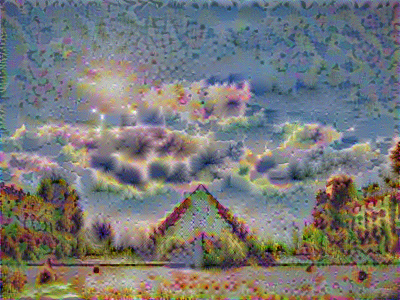

# Neural Style Transfer generated on Tensorflow

## Work from Deep learning Specialization : Course 4 : Week 4 : Assignment 1
## Deep Learning & Art: Neural Style Transfer

 Implemented neural style transfer algorithm and generated novel artistic images using the algorithm.  

 This algorithm was created by Gatys et al. (2015) (https://arxiv.org/abs/1508.06576).  

### Results:

 +   =  

 +   =  

